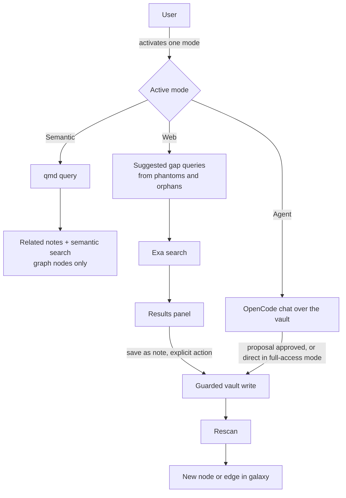
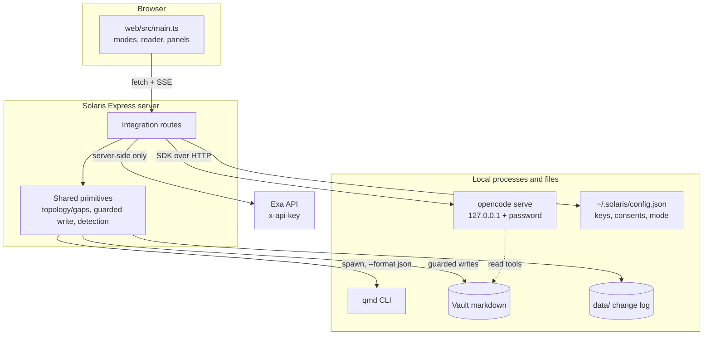
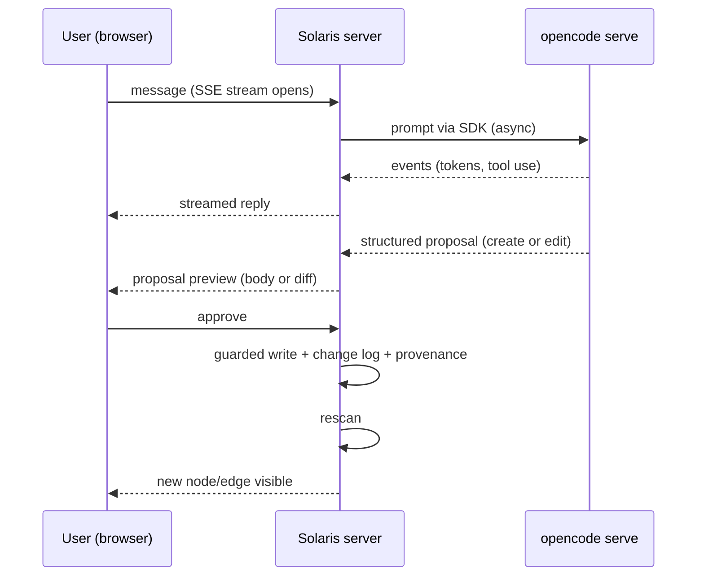
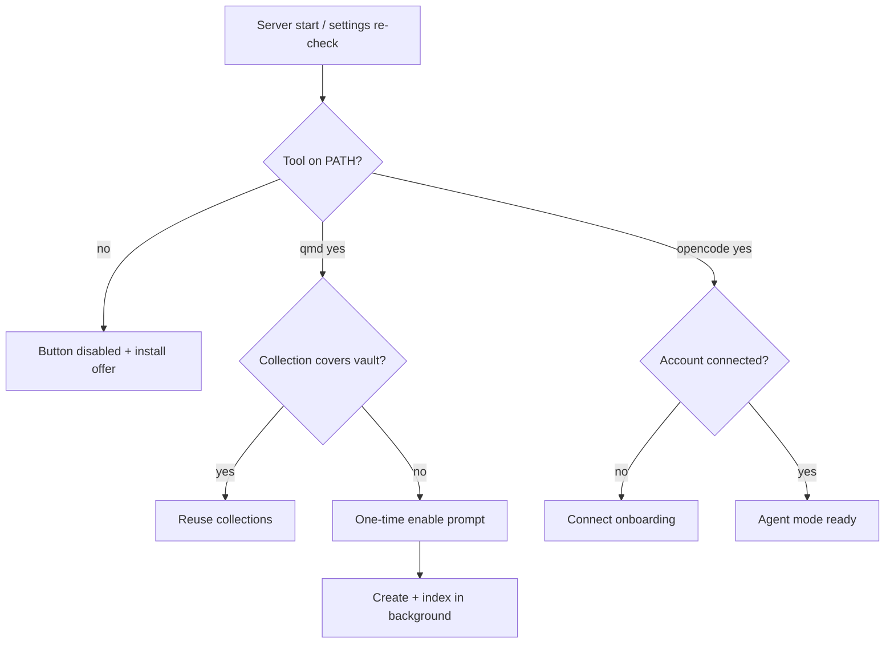

# Optional Integrations Layer (qmd, Exa, OpenCode) - Plan

## Goal Capsule

- **Objective:** Give Solaris an optional integrations layer with three mutually exclusive modes next to search (Semantic via qmd, Web via Exa, Agent via OpenCode), delivered in three milestones, starting with a semantic "Related notes" section at the end of every note in the reader.
- **Product authority:** The Product Contract below. Product Contract preservation: changed R13, R14, R15 (amended) and added R17-R19 — OpenCode Zen's zero-config claim was refuted against primary docs, and the user expanded the agent trust model to selectable permission modes with note editing as a first-class capability; consent and audit requirements were added with user confirmation.
- **Execution profile:** Three milestone phases, dependency-ordered units, server-first. Frontend changes verified manually per repo convention; server changes test-first with vitest + supertest.
- **Stop conditions:** Surface as a blocker anything that would widen the agent's write surface beyond the sanctioned endpoints, weaken the path-confinement guard, or expose the Exa key to the browser. Do not resolve those by guessing.
- **Open blockers:** None. Remaining open questions are deferred to implementation (see Outstanding Questions).

---

## Product Contract

### Summary

Solaris gains an optional integrations layer: three icon buttons with tooltips next to the search bar, Semantic (qmd), Web (Exa), and Agent (OpenCode), each enabled only when its tool is installed and configured, with at most one mode active at a time. Delivery order: Milestone 1 ships the shared chrome plus semantic related notes and semantic search; Milestone 2 ships web research with gap-closing suggested queries; Milestone 3 ships the conversational agent with selectable permission modes.

### Problem Frame

The galaxy only shows relations that were typed as links. Notes that are semantically close but never linked stay invisible in both the reader and the graph, and search is keyword-only, so those hidden relations are unreachable. The vault also accumulates visible gaps, phantom nodes, orphans, and sparse clusters, that today are dead ends: Solaris shows them but offers no path to close them. Meanwhile the user may already run local and web tools (qmd for semantic retrieval, Exa for web research, OpenCode for agents) that Solaris ignores entirely. For users with none of these tools, Solaris must remain exactly as frictionless as it is today.

### Key Decisions

- **Optional, detection-based integrations with a two-flavor install.** Solaris stays fully functional with no tool installed, and each mode button lights up only when its tool is detected. Installation offers two flavors: core-only, and core plus addons; the addons flavor verifies what is already on the system and auto-installs only the missing tools (qmd, OpenCode). Exa is a hosted API with nothing to install; it is configured by key in settings.
- **Write contract: no writes without consent.** The scanner never writes to the vault. Vault writes happen only through the guarded write endpoint, triggered by user consent: per-change consent in the default approval mode (save an Exa result, approve an agent proposal), or standing consent when the user enables the agent's full-access mode. No automatic or background writes outside those consents. A rescan materializes each change in the galaxy.
- **Agent permission modes, constrained by construction.** In approval mode the agent cannot write or run shell commands at all; its only mutation path is proposing a create or edit that Solaris applies after approval with a full preview. In full-access mode, which the user enables explicitly, the agent edits and creates notes directly within the vault. Both modes are audited.
- **Note editing is a first-class agent capability.** Closing a gap includes weaving relations: the agent can edit the note that originated an investigation to reference the new gap note, so the new wikilink becomes a graph edge at rescan.
- **Related notes limited to graph nodes.** Every related-notes result is actionable: click opens the note and flies the camera. Content qmd has indexed but that is not in the current graph does not appear.
- **qmd setup via one-time prompt, reusing existing collections.** When qmd is installed but no collection covers the scanned folder, a single UI prompt offers to enable semantic features; accepting creates the collection and indexes in the background. When existing collections already cover the folder, Solaris reuses them and never duplicates indexing.
- **Gap questions come from graph topology, no LLM required.** Suggested web queries derive from phantom nodes, orphans, and sparsely connected clusters, enriched with qmd semantic context when available. No full-content analysis at startup; generation happens when Web mode is activated. The Agent refines suggestions when installed.
- **Relatedness computed on demand.** The related-notes section queries qmd with the opened note's own text, asynchronously, per note. A precomputed vault-wide relatedness map is the named evolution for when semantic edges in the 3D graph arrive (deferred).

### Actors

- A1. Explorer, the user: navigates the galaxy, reads notes, triggers searches and research, chooses the agent permission mode, approves changes in approval mode.
- A2. Solaris server: bridge between the web UI and the tools; writes into the vault only through the guarded write endpoint under a user consent, never on its own.
- A3. qmd: local hybrid search index over the vault's markdown.
- A4. Exa: web search API, authenticated with the user's own key, never called from the browser.
- A5. OpenCode agent: conversational agent over the vault; proposes creates and edits in approval mode, writes directly in user-enabled full-access mode.

### Requirements

**Milestone 1, shared integration chrome**

- R1. Three icon buttons with name tooltips sit next to the search bar: Semantic (qmd), Web (Exa), Agent (OpenCode). At most one mode is active at a time.
- R2. Each button is enabled only when its tool is detected as installed and configured; a disabled button explains what is missing and offers the fix (install the addon, or configure the Exa key).
- R3. A settings section manages integration configuration and API keys (Exa). Secrets are stored in local configuration outside the vault and outside version control, and are never written into the vault or committed.
- R16. Installation comes in two flavors: core-only, and core plus addons. The addons flavor checks for existing installs first and auto-installs only what is missing (qmd, OpenCode); it never reinstalls or duplicates an existing setup.

**Milestone 1, Semantic mode (qmd)**

- R4. Every note opened in the reader ends with a visibly labeled section, "Related notes (semantic)", listing semantically related notes. It loads asynchronously and never blocks reading the note.
- R5. Related results contain only notes that exist as nodes in the current graph. Clicking a result opens it in the reader and flies the camera to its node.
- R6. First activation: with qmd installed and no collection covering the scanned folder, a one-time prompt offers to enable semantic features; accepting creates the collection and indexes in the background. While the index builds, semantic surfaces show an "indexing" state instead of results.
- R7. When existing qmd collections cover the scanned folder, Solaris reuses them instead of creating a new one.
- R8. The Filters panel gains a "Collections" group with per-collection on and off toggles that scope every qmd-powered surface (related notes and semantic search).
- R9. With Semantic mode active, the search box returns qmd-powered results mapped to graph nodes, using the existing search-results UI.

**Milestone 2, Web mode (Exa)**

- R10. Activating Web mode presents around five suggested gap-closing queries generated from graph topology (phantom nodes, orphans, sparse clusters), enriched with qmd context when available. The user can pick one or type their own.
- R11. Queries run against the Exa search API with the user's configured key, proxied through the Solaris server; results render in a panel inside Solaris.
- R12. Any Exa result can be saved as a new note through an explicit user action. Default destination is `inbox/` under the scanned root, configurable. A rescan then shows the new node.

**Milestone 3, Agent mode (OpenCode)**

- R13. Activating Agent mode opens a conversation with an OpenCode-powered agent whose context is the vault. First use requires a one-time Connect onboarding (browser sign-in to an OpenCode account); Zen free models allow trying it without paying. The default model is configurable; no free model name is hardcoded.
- R14. The agent proposes new notes and edits to existing notes (for example, inserting a reference to a new gap note in the note that originated the investigation). In approval mode every change requires user approval with a full preview: destination path, frontmatter, and body for creates, a diff for edits; reject and edit-before-approve are supported.
- R15. The agent's vault retrieval uses qmd when installed and can read graph topology (phantoms, orphans, sparse clusters), independent of which UI mode button is currently lit.
- R17. Agent permission modes are user-selectable: approval mode (default, per-change approval) and full-access mode (explicit opt-in, agent creates and edits directly within the vault). No write happens without consent: per-change in approval mode, standing in full-access mode.

**Cross-cutting trust**

- R18. Before the first request that sends vault-derived content off the machine (Web mode, Agent mode), a one-time per-mode consent gate discloses the egress and, for Agent mode, that free Zen models may use conversation data for training. Project documentation scopes the "nothing is uploaded" promise to the core.
- R19. Every agent write, in both permission modes, is recorded in a local change log, and agent-created notes carry provenance frontmatter distinguishing them from human notes.

### Key Flows

- F1. First semantic activation
  - **Trigger:** Solaris starts with qmd installed and no covering collection.
  - **Steps:** One-time prompt appears; user accepts; collection is created and indexing runs in the background; semantic surfaces show "indexing"; results appear when ready.
  - **Covers:** R6, R7.
- F2. Related notes
  - **Trigger:** User opens a note in the reader.
  - **Steps:** Note renders immediately; "Related notes (semantic)" loads async; user clicks a result; the note opens and the camera flies to its node.
  - **Covers:** R4, R5.
- F3. Web research closes a gap
  - **Trigger:** User activates Web mode.
  - **Steps:** On first use, the consent gate appears; then around five suggested queries appear; user picks or types one; Exa results render; user saves one result as a note; rescan shows the new node in the galaxy.
  - **Covers:** R10, R11, R12, R18.
- F4. Agent conversation, approval mode
  - **Trigger:** User activates Agent mode (after one-time Connect onboarding and consent gate).
  - **Steps:** Chat opens with the vault as context; the agent answers using the vault (qmd and topology per R15); the agent proposes a gap note plus an edit linking it from the originating note; user reviews previews and approves; both changes land through the guarded write; rescan shows the new node and edge.
  - **Covers:** R13, R14, R15, R18, R19.
- F5. Agent conversation, full-access mode
  - **Trigger:** User enables full-access mode in settings (standing consent).
  - **Steps:** The agent creates and edits notes directly during the conversation; each change is logged; rescan reflects them.
  - **Covers:** R17, R19.

### Acceptance Examples

- AE1. **Covers R2.** Given qmd is not installed, when Solaris starts, then no Semantic button, related-notes section, or collection toggles appear anywhere, and settings offer to install the addons.
- AE2. **Covers R7, R8.** Given existing qmd collections cover the scanned folder, when semantic features activate, then no new collection is created and the Filters panel lists those collections as toggles.
- AE3. **Covers R5.** Given a note whose qmd-related documents include files excluded from the scan, when the related section loads, then those files do not appear.
- AE4. **Covers R6.** Given the first indexing run is still generating embeddings, when the user opens notes, then the related section shows an "indexing" state and no errors.
- AE5. **Covers R2, R3.** Given no Exa API key is configured, when the user hovers the Web button, then it is disabled with a tooltip pointing to settings.
- AE6. **Covers R14.** Given the agent proposes a note and the user rejects it, then nothing is written to the vault.
- AE7. **Covers R16, R7.** Given the user picks the addons install flavor and qmd is already installed, then qmd is not reinstalled and its existing collections and configuration are respected.
- AE8. **Covers R18.** Given Web mode has never been used, when the user activates it, then the consent gate appears before any request leaves the machine, and declining sends nothing.
- AE9. **Covers R17, R19.** Given full-access mode is enabled and the agent edits an existing note, then the edit is applied without a per-change prompt, appears in the change log, and the new wikilink shows as an edge after rescan.
- AE10. **Covers R14.** Given the agent proposes an edit to an existing note in approval mode, when the user reviews it, then a diff of the change is shown, and rejecting leaves the file untouched.

### Success Criteria

- With the index ready, opening a note shows related in-graph notes within one to two seconds, without blocking the reader.
- A user with none of the three tools sees Solaris exactly as it is today: no new friction, no dead chrome beyond the disabled hints.
- A user can hold a useful conversation with their vault after a single free account connect, without paying.

### Scope Boundaries

**Deferred for later**

- Semantic edges rendered and filterable in the 3D graph.
- Semantic grouping and coloring mode for nodes (today grouping is by folder or tag).
- Mini graph (constellation) of related notes inside the reader pane.
- Precomputed vault-wide relatedness map at scan time, the evolution of the on-demand mechanism and prerequisite for semantic edges.
- A dedicated results-panel layout for search modes (attached and detached arrangements); v1 reuses the existing search-results UI.
- Agent-driven view control (fly camera, open notes in the reader on the user's behalf), agent-initiated Exa searches, and agent manipulation of filters or grouping.

**Outside this product's identity**

- Silent writes without consent. Solaris does not become a CMS or an auto-organizer.
- Arbitrary agent filesystem or shell access outside the sanctioned write path, in any permission mode.

### Dependencies / Assumptions

- qmd, the Exa API, and OpenCode are external dependencies detected at runtime; none is bundled.
- The Exa API always requires an API key (`x-api-key` header); there is no keyless mode (verified against the search API guide). Web mode depends on the user configuring a key. Exa renamed request parameters twice in the last 12 months; treat its request shape as unstable.
- OpenCode Zen free models exist but require a one-time account connect (browser sign-in with billing details on file, no charge) and are offered "for a limited time"; free models may use conversation data for training (verified against opencode.ai/docs/zen, 2026-07).
- OpenCode exposes a headless HTTP server (`opencode serve`) and a typed SDK (`@opencode-ai/sdk`); per-tool permissions are configurable (allow/ask/deny). The project moved to the `anomalyco` GitHub org; the docs domain and npm scope are unchanged.
- Scanner excludes are a fixed named list (`scanner/scan.ts` `DEFAULT_EXCLUDES`), not a general dotfolder rule; what enters the graph, and therefore related results, depends on the user's exclude configuration (verified).
- qmd has no "similar to this document" command; relatedness is computed by querying with the note's own text (verified against `qmd --help`).
- qmd exposes collection root paths (`qmd collection show`), enough to detect whether existing collections cover a scanned folder (verified).

### Outstanding Questions

**Deferred to implementation (non-blocking)**

- Whether `opencode serve` takes an explicit directory flag or inherits its launch cwd; verify against `opencode serve --help` before wiring the vault workspace.
- Exact template wording for topology-derived suggested queries; tune against a real vault.
- Whether qmd semantic search needs pagination or richer result rows than the existing dropdown; ship capped results first.

### Sources / Research

- `server/app.ts`: `createApp()` factory, `/api/search` (lazy MiniSearch over titles and content, 20 hits), `/api/note` with path-traversal guard (`resolve` under `vaultRoot + sep`, `.md` only, `phantom:` rejected), `POST /api/rescan`.
- `scanner/scan.ts`: node id = vault-relative path; phantom ids are `phantom:` + lowercased target; `NodeRec.in/out` support orphan derivation; `DEFAULT_EXCLUDES` named list.
- `web/src/main.ts` (2449 lines, single file, imperative DOM): `openReader()` reader pipeline (frontmatter strip, wiki-link regex, `marked.parse`), `select(n)` open-note-plus-fly primitive, search wiring with client title match + debounced `/api/search` and `addResult()` rows, Filters panel state in `localStorage["akasha-filters"]`, `akasha-*` key namespace, menubar dropdown click-outside gotcha.
- `bin/cli.ts`: npx entry; per-vault local data dir at `~/.solaris/<hash>/`; only existing `child_process` use (browser open).
- `tsconfig.json`: `include` omits `bin/` and `desktop/`, so `npm run typecheck` currently skips them.
- Tests: vitest, `scanner/scan.test.ts` (fixtures) and `server/app.test.ts` (supertest, temp-dir vaults). Frontend has no test framework; manual verification per `CLAUDE.md`.
- Exa: search API guide https://exa.ai/docs/reference/search-api-guide (key required via `x-api-key`; `type` values are effort-based: auto/instant/fast/deep/deep-reasoning; old `/research` endpoint removed 2026-04); SDK `exa-js` https://www.npmjs.com/package/exa-js; billing https://exa.ai/docs/reference/billing ($10 signup credit; contents priced per page per content type).
- OpenCode: server https://opencode.ai/docs/server/ (`opencode serve`, OpenAPI at `/doc`, `OPENCODE_SERVER_PASSWORD`); SDK https://opencode.ai/docs/sdk/ (`createOpencodeClient`); permissions https://opencode.ai/docs/permissions/ (allow/ask/deny per tool, glob patterns); Zen https://opencode.ai/docs/zen/ (free models, connect flow); install `curl -fsSL https://opencode.ai/install | bash`.
- qmd install: `bun install -g https://github.com/tobi/qmd` (requires Bun; SQLite on macOS). JSON output via `--format json` with `docid`, `score`, `file`, `line`, `title`, `snippet`.
- Prior plan: `docs/plans/2026-07-01-001-feat-solaris-fork-plan.md` (chrome placement rationale: search top, Filters bottom-left, Settings bottom-right).

---

## Planning Contract

### Key Technical Decisions

- **KTD1. All integration traffic goes through the Solaris server.** The browser never calls Exa or OpenCode directly; the Exa key and the OpenCode server password never reach the frontend. New Express routes follow the existing `createApp()` inline-closure pattern.
- **KTD2. OpenCode embeds as a managed child process.** The Solaris server spawns `opencode serve` bound to 127.0.0.1 with `OPENCODE_SERVER_PASSWORD` set, scoped to the vault directory, and talks to it via `@opencode-ai/sdk` (`createOpencodeClient`), pinned to an exact version (near-daily releases). Chat uses the async prompt + event stream, surfaced to the browser over SSE with a cancel control.
- **KTD3. Permission modes compile to OpenCode permission config.** Approval mode: `edit` and `bash` denied; the agent returns structured proposals that Solaris renders for approval and applies through the guarded write endpoint. Full-access mode: `edit` allowed and scoped to the vault root, `bash` stays denied. Every applied change, either path, is journaled (R19). All Solaris-side writes reuse the `/api/note` confinement guard (resolve under vault root, `.md` only).
- **KTD4. Exa sits behind a thin server-side adapter** isolating its unstable request shape (two param-rename rounds in 12 months). Defaults: `type: auto`, highlights-only contents for cost; deep modes opt-in with a progress indicator; defensive retry/backoff since rate limits are undocumented.
- **KTD5. Config and secrets live in `~/.solaris/config.json`** (mode 600), following the existing per-vault local data-dir convention: Exa key, per-mode consents, agent permission mode, default model, addons state. The status endpoint reports booleans (configured or not), never key material.
- **KTD6. Topology is one shared server module.** Phantoms (`phantom:` nodes), orphans (`in + out === 0`), and sparse clusters are computed from the in-memory graph in one module consumed by both the Web-mode suggestion endpoint and the agent's read context (R15). Suggested queries are template-based from phantom and orphan titles, enriched with qmd snippets when available; no LLM.
- **KTD7. Detection is a PATH probe plus health checks**, run at server start and re-runnable from settings: binary presence and version for qmd and OpenCode, key presence for Exa, connect status for OpenCode via its own server. Results cached in memory.
- **KTD8. Two-flavor install is a first-run choice, not two packages.** The core npx flow is unchanged; the addons flavor is offered by a first-run UI prompt (and a CLI flag) that runs installs server-side: OpenCode via its official one-liner, qmd via Bun only when Bun exists, otherwise guided instructions. Existing installs are never touched (R16).
- **KTD9. Frontend stays framework-free and imperative**, matching the single-file style: mode state in `localStorage["akasha-mode"]`, collection toggles in `localStorage["akasha-collections"]`, related section appended inside `openReader()` after the note renders, semantic search reusing the existing results dropdown and `addResult()` rows, collections group as a new section inside the Filters panel.
- **KTD10. Fix the typecheck blind spot first.** Add `bin` and `desktop` to `tsconfig.json` `include` so installer and CLI changes are covered by `npm run typecheck`.
- **KTD11. Re-scope the trust promise in docs.** README and `CLAUDE.md` currently promise "nothing is uploaded"; that stays true for the core and becomes "opt-in egress with consent gates" for Web and Agent modes.
- **KTD12. Local-origin enforcement on the expanded server surface.** The localhost server has no auth by design; adding write, research (credit-spending), agent, setup, and install endpoints creates a CSRF/DNS-rebinding surface any local webpage could hit. Mitigation: a Host/Origin validation middleware on all routes, plus a per-session token issued with the app page and required on every mutating or spending endpoint.

### High-Level Technical Design

Component topology:

Agent turn, approval mode:

Setup and detection decisions:

---

## Implementation Units

Unit Index:

| U-ID | Title | Key files | Depends on |
|---|---|---|---|
| U1 | Integrations config, secrets, detection | `server/integrations/config.ts`, `detect.ts`, `server/app.ts`, `tsconfig.json` | — |
| U2 | Mode selector chrome + settings UI | `web/index.html`, `web/src/main.ts`, `web/src/style.css` | U1 |
| U3 | qmd bridge: setup, related, semantic search | `server/integrations/qmd.ts`, `server/app.ts` | U1 |
| U4 | Semantic surfaces in the UI | `web/src/main.ts`, `web/index.html` | U2, U3 |
| U5 | Topology/gaps primitive | `server/integrations/topology.ts`, `server/app.ts` | — |
| U6 | Exa adapter + research endpoint | `server/integrations/exa.ts`, `server/app.ts` | U1 |
| U7 | Guarded note-write endpoint | `server/integrations/write.ts`, `server/app.ts` | U1 |
| U8 | Web mode UI | `web/src/main.ts`, `web/index.html` | U2, U5, U6, U7 |
| U9 | OpenCode bridge | `server/integrations/opencode.ts`, `server/app.ts` | U1 |
| U10 | Approval gate, audit log, provenance | `server/integrations/proposals.ts`, `server/app.ts` | U7, U9 |
| U11 | Agent chat UI + Connect onboarding | `web/src/main.ts`, `web/index.html` | U2, U9, U10 |
| U12 | Two-flavor installer + trust-model docs | `bin/cli.ts`, `server/integrations/install.ts`, `README.md`, `CLAUDE.md` | U1 |

**Milestone 1 — shared chrome + Semantic (U1-U4). Milestone 2 — Web (U5-U8). Milestone 3 — Agent + installer (U9-U12).**

### U1. Integrations config, secrets, and detection service

- **Goal:** Server-side foundation: local config with secrets, tool detection, and a status endpoint the UI drives everything from.
- **Requirements:** R2, R3.
- **Dependencies:** None.
- **Files:** `server/integrations/config.ts`, `server/integrations/detect.ts`, `server/integrations/config.test.ts`, `server/integrations/detect.test.ts`, `server/app.ts` (mount `GET /api/integrations`), `tsconfig.json` (add `bin`, `desktop` to `include`, KTD10).
- **Approach:** Config read/write at `~/.solaris/config.json` with 600 permissions (KTD5). Detection per KTD7 with an injectable command-runner so tests never depend on real binaries. The status endpoint returns per-tool state (installed, version, configured, connected) and booleans only for secrets. Also lands KTD12's middleware: Host/Origin validation on all routes and a per-session token, issued with the app page, enforced on every mutating or spending route added by later units.
- **Patterns to follow:** `createApp()` inline route closures with try/catch 500s (`server/app.ts`); per-vault data dir convention (`bin/cli.ts`).
- **Test scenarios:** status reports each tool absent/present/configured from a faked runner; config file created with 600 perms; Exa key never appears in the status payload; corrupt config file yields defaults plus a logged warning, not a crash; re-check endpoint refreshes a changed PATH state; request with a foreign Host header rejected on every route; mutating request without the session token rejected while the same request with it succeeds.
- **Verification:** `npm test` green; `npm run typecheck` now covers `bin/` and `desktop/` and passes.

### U2. Mode selector chrome + integrations settings UI

- **Goal:** The three mode buttons with tooltips and disabled-state explanations, plus the settings section (Exa key entry, statuses, agent permission mode selector, consents).
- **Requirements:** R1, R2, R3, R17 (selector only).
- **Dependencies:** U1.
- **Files:** `web/index.html`, `web/src/main.ts`, `web/src/style.css`.
- **Approach:** Buttons inside `#search-wrap`'s topbar area; one-active-at-a-time state persisted as `localStorage["akasha-mode"]` (KTD9). Disabled buttons carry tooltip text from `/api/integrations`. Settings gets an "Integrations" block following the existing panel patterns; key entry posts to the server, never stored client-side.
- **Patterns to follow:** `#filters-btn`/`#settings-btn` toggle pattern; `akasha-*` localStorage namespace; menubar click-outside gotcha if any popover is added.
- **Test scenarios:** Test expectation: none — frontend has no test framework (repo convention); covered by the manual checklist in the Verification Contract.
- **Verification:** Manual: with no tools installed the UI matches AE1/AE5; mode exclusivity holds; key save round-trips to `GET /api/integrations` as a boolean.

### U3. qmd bridge: setup, related notes, semantic search

- **Goal:** Server endpoints wrapping the qmd CLI: coverage detection, one-time setup with background indexing, related-notes, and semantic search, all scoped to graph nodes.
- **Requirements:** R4 (data), R5 (filtering), R6, R7, R8 (collection param), R9 (data).
- **Dependencies:** U1.
- **Files:** `server/integrations/qmd.ts`, `server/integrations/qmd.test.ts`, `server/app.ts` (routes `GET /api/related?id=`, `GET /api/semantic-search?q=`, `POST /api/qmd/setup`, `GET /api/qmd/status`).
- **Approach:** Spawn `qmd` with `--format json`; map result `file` paths to graph node ids and drop non-nodes (R5); accept a collections filter (R8). Coverage check via `qmd collection list`/`show` against the vault root (R7). Setup creates the collection and runs indexing in the background; status reports indexing/ready. Related queries use the note's title plus an excerpt as query text.
- **Execution note:** Test-first with a faked qmd runner; never invoke the real binary in tests.
- **Test scenarios:** qmd path → node id mapping (including files outside the graph dropped, AE3); collection coverage detected for exact root and parent-path collections (AE2); setup skipped when coverage exists; status returns "indexing" while the background job runs (AE4); collections filter narrows results; qmd binary missing yields a clean 503, not a crash; malformed qmd JSON yields empty results plus a logged warning.
- **Verification:** `npm test` green; manual: `/api/related?id=` returns in-graph notes for a real vault note.

### U4. Semantic surfaces in the UI

- **Goal:** The "Related notes (semantic)" section in the reader, collection toggles in Filters, semantic search wiring, and the one-time setup prompt.
- **Requirements:** R4, R5, R6 (prompt UX), R8, R9.
- **Dependencies:** U2, U3.
- **Files:** `web/src/main.ts`, `web/index.html`, `web/src/style.css`.
- **Approach:** Append the labeled section inside `openReader()` after the note body renders, loading async with loading/indexing/empty states; result clicks call `select(n)` (KTD9). Collections group renders inside `#filters` with state in `localStorage["akasha-collections"]`. With Semantic mode active, the search box swaps its content-search source to `/api/semantic-search`, reusing `addResult()` rows. Setup prompt fires once when status says qmd-present-without-coverage.
- **Patterns to follow:** `openReader()` loading-then-replace; `renderFilters()` imperative rows; search debounce + dedup pattern.
- **Test scenarios:** Test expectation: none — frontend has no test framework; covered by the manual checklist (AE1-AE4 behaviors).
- **Verification:** Manual: F1 and F2 flows end-to-end on a real vault; toggling a collection changes related results; section header always visible with qmd active.

### U5. Topology/gaps primitive

- **Goal:** One shared server module computing phantoms, orphans, and sparse clusters, exposed for Web-mode suggestions and reused as agent context.
- **Requirements:** R10 (source data), R15 (agent context).
- **Dependencies:** None.
- **Files:** `server/integrations/topology.ts`, `server/integrations/topology.test.ts`, `server/app.ts` (route `GET /api/gaps`).
- **Approach:** Compute from the loaded graph per KTD6: phantom nodes with their inbound linkers, orphans via `in + out === 0`, sparse clusters via a cheap degree/component heuristic. Suggested queries are templates over phantom/orphan titles, optionally enriched with a qmd snippet when U3 is available. Cap output; recompute on `reload()`.
- **Test scenarios:** fixture graph produces expected phantoms with linker context; orphans detected; a well-connected fixture yields no false gaps; suggestion count capped at five; qmd enrichment absent → templates still produced.
- **Verification:** `npm test` green; manual: `/api/gaps` on a real vault returns sensible suggestions.

### U6. Exa adapter and research endpoint

- **Goal:** Server-side Exa proxy behind a thin adapter, with consent enforcement.
- **Requirements:** R11, R18 (enforcement).
- **Dependencies:** U1.
- **Files:** `server/integrations/exa.ts`, `server/integrations/exa.test.ts`, `server/app.ts` (route `POST /api/research`), `package.json` (add `exa-js`, pinned).
- **Approach:** Adapter isolates the exa-js request shape (KTD4): defaults `type: auto`, highlights-only contents; optional deep mode flag. Endpoint rejects when no key (mapping to AE5's disabled state) or when Web-mode consent is absent in config (R18). Retry/backoff on transient failures.
- **Test scenarios:** request without stored consent → 403 and no outbound call (AE8 server side); missing key → 4xx with actionable message; adapter maps a canned Exa response to the UI shape; response never echoes the key; transient failure retries then surfaces a clean error.
- **Verification:** `npm test` green; manual: a real query with a configured key returns results.

### U7. Guarded note-write endpoint

- **Goal:** The single sanctioned vault-write path: create and edit markdown files under the confinement guard, used by save-as-note and all agent writes.
- **Requirements:** R12 (write mechanics), R14/R17 (write mechanics), R19 (journal hook).
- **Dependencies:** U1.
- **Files:** `server/integrations/write.ts`, `server/integrations/write.test.ts`, `server/app.ts` (routes `POST /api/notes`, `PUT /api/notes`).
- **Approach:** Reuse the `/api/note` confinement logic for destinations: resolve under vault root, `.md` only, reject `phantom:`. Creates default to `inbox/` (configurable, R12); edits apply full-content replacement received from an approved proposal. Every write appends a change-log entry in the local data dir (consumed by U10). Filename collisions get a suffix, never an overwrite, unless the request is an explicit edit of that path.
- **Execution note:** Test-first; this is the security-sensitive unit.
- **Test scenarios:** traversal attempts (`../`, absolute paths, symlink-style ids) rejected; non-`.md` rejected; write without the session token rejected (KTD12); create lands in `inbox/` by default and in a configured destination when set; create never overwrites an existing file; edit modifies only the target; each write produces a change-log entry; write with vault root missing fails cleanly.
- **Verification:** `npm test` green, including every negative path above.

### U8. Web mode UI

- **Goal:** The Web-mode experience: consent gate, suggested queries, results panel, save-as-note with rescan.
- **Requirements:** R10, R11, R12, R18 (UX).
- **Dependencies:** U2, U5, U6, U7.
- **Files:** `web/src/main.ts`, `web/index.html`, `web/src/style.css`.
- **Approach:** First activation renders the consent modal; accept persists via the server, decline leaves the mode off (AE8). Active mode shows suggestions from `/api/gaps` above the search box, results in a panel, and a save action per result that posts to `/api/notes`, then triggers the existing rescan flow so the new node appears.
- **Patterns to follow:** existing modal/panel toggling; `mi-rescan` rescan-then-reload flow.
- **Test scenarios:** Test expectation: none — frontend has no test framework; covered by the manual checklist (F3 flow, AE8).
- **Verification:** Manual: full F3 flow on a real vault ending with the new node visible.

### U9. OpenCode bridge

- **Goal:** Managed `opencode serve` lifecycle and a streaming chat API for the frontend.
- **Requirements:** R13, R15, R17 (profile generation).
- **Dependencies:** U1.
- **Files:** `server/integrations/opencode.ts`, `server/integrations/opencode.test.ts`, `server/app.ts` (routes `POST /api/agent/session`, `POST /api/agent/message`, `GET /api/agent/stream` SSE, `POST /api/agent/cancel`, `GET /api/agent/status`), `package.json` (add `@opencode-ai/sdk`, pinned exact).
- **Approach:** Per KTD2/KTD3: spawn `serve` on 127.0.0.1 with a generated `OPENCODE_SERVER_PASSWORD`, scoped to the vault (verify the dir flag per Outstanding Questions); generate the permission config per mode (approval: `edit`/`bash` deny; full-access: `edit` allow within vault, `bash` deny); SDK client server-side; async prompt + events relayed as SSE with cancel. Status surfaces installed/connected for the Connect onboarding (R13). Seed the agent context with topology summary and qmd availability (R15).
- **Test scenarios:** permission config per mode matches the matrix (approval denies edit and bash; full-access allows edit, still denies bash); child process restarted after crash with a capped backoff; cancel tears down the stream; status distinguishes not-installed / installed-not-connected / ready; password set on spawn and never sent to the browser.
- **Verification:** `npm test` green; manual: a streamed reply from a connected OpenCode with a Zen model.

### U10. Approval gate, audit log, and provenance

- **Goal:** Proposal lifecycle for agent changes and the audit trail both modes share.
- **Requirements:** R14, R17, R19.
- **Dependencies:** U7, U9.
- **Files:** `server/integrations/proposals.ts`, `server/integrations/proposals.test.ts`, `server/app.ts` (routes `GET /api/agent/proposals`, `POST /api/agent/proposals/:id/approve`, `POST /api/agent/proposals/:id/reject`).
- **Approach:** Proposals (create: path+frontmatter+body; edit: path+diff) are held server-side; approve applies through U7's guarded write, reject discards (AE6, AE10); edit-before-approve accepts modified content on approve. Provenance frontmatter injected on agent-created notes; the change log records actor, mode, path, and timestamp for every applied change (both permission modes). In full-access mode the agent's direct edits (via its own `edit` tool) are detected from OpenCode events and journaled too.
- **Execution note:** Test-first; this unit proves the trust model.
- **Test scenarios:** reject → vault untouched (AE6); approve create → file written with provenance frontmatter and journal entry; approve edit → diff applied, journal entry (AE10); edit-before-approve persists the user's modified body; approval-mode agent cannot reach `/api/notes` without a proposal id; full-access direct edit produces a journal entry (AE9 server side); journal survives server restart.
- **Verification:** `npm test` green, including the negative trust scenarios.

### U11. Agent chat UI, Connect onboarding, and permission modes

- **Goal:** The Agent-mode experience: consent + Connect onboarding, streaming chat with cancel, proposal previews with diff, permission mode switch.
- **Requirements:** R13, R14, R17, R18 (UX).
- **Dependencies:** U2, U9, U10.
- **Files:** `web/src/main.ts`, `web/index.html`, `web/src/style.css`.
- **Approach:** First activation walks consent (R18) then Connect (R13) driven by `/api/agent/status`. Chat panel streams via SSE with a stop button; proposals render inline with body preview or diff and approve/edit/reject actions; full-access toggle lives in settings with an explicit standing-consent confirmation (R17). Model selection reads from config (no hardcoded free model).
- **Patterns to follow:** existing panel patterns; reader-pane loading states; menubar click-outside gotcha for any popover.
- **Test scenarios:** Test expectation: none — frontend has no test framework; covered by the manual checklist (F4, F5, AE9, AE10).
- **Verification:** Manual: F4 end-to-end (propose → approve → node + edge after rescan) and F5 with full-access enabled.

### U12. Two-flavor installer and trust-model docs

- **Goal:** The core-vs-addons install choice, server-side addon installation, and the documentation trust-model update.
- **Requirements:** R16, R2 (install offers), R18 (docs part).
- **Dependencies:** U1.
- **Files:** `bin/cli.ts` (flag + first-run wiring), `server/integrations/install.ts`, `server/integrations/install.test.ts`, `server/app.ts` (route `POST /api/integrations/install`), `README.md`, `CLAUDE.md`.
- **Approach:** Per KTD8: a CLI flag and a first-run UI prompt trigger server-side installs; the installer checks existing installs first (R16, AE7), installs OpenCode via its official one-liner, installs qmd via Bun only when Bun is present, and otherwise returns guided instructions instead of failing. Docs: re-scope the "nothing is uploaded" promise per KTD11 and document the three modes and their consent gates.
- **Test scenarios:** existing qmd → install skipped, config untouched (AE7); missing Bun → guided-instructions result, no partial install; install failure surfaces the tool's stderr cleanly; both flavors leave core behavior identical when addons are declined.
- **Verification:** `npm test` green; manual: fresh-machine dry-run of the prompt path; docs read consistently with the shipped behavior.

---

## Verification Contract

| Gate | Command | Applies to |
|---|---|---|
| Unit and route tests | `npm test` | U1, U3, U5, U6, U7, U9, U10, U12 (server, scanner untouched but must stay green) |
| Type safety | `npm run typecheck` | All units; includes `bin/` and `desktop/` after U1 |
| Manual visual checklist | `npm run dev` against a real vault | U2, U4, U8, U11 (frontend has no test framework, per repo convention) |

Manual checklist per milestone: M1 = AE1-AE5 plus flows F1, F2; M2 = AE8 plus flow F3; M3 = AE6, AE9, AE10 plus flows F4, F5. The trust-model negative tests (traversal, sandbox denial, consent enforcement, local-origin/token enforcement) are automated in U1, U7, U9, U10 and are release-blocking.

---

## Definition of Done

- All twelve units landed in dependency order with their listed tests passing under `npm test` and `npm run typecheck` green.
- Every acceptance example (AE1-AE10) demonstrated: automated where the Verification Contract maps it to a test, otherwise via the milestone manual checklist.
- A vault user with none of the three tools sees no behavior change beyond disabled mode buttons with install offers.
- Secrets never appear in the repo, the vault, git history, or any API response body.
- README and `CLAUDE.md` reflect the re-scoped trust model and the two install flavors.
- No dead or experimental code from abandoned approaches remains in the diff.
