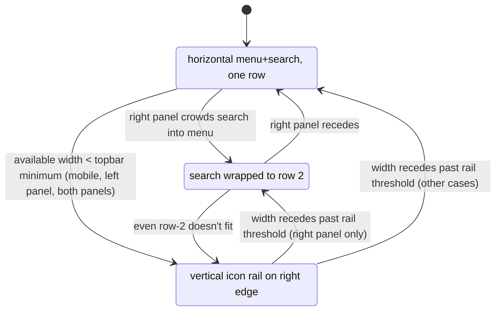

# Responsive Topbar Rail - Plan

## Goal Capsule

- **Objective:** Add a third topbar state — a vertical icon "rail" on the right edge with flyouts — that engages when available width is too narrow for the horizontal menu+search, so the topbar never overlaps docked panels or runs out of room; and revise the left-panel collapse to continuous-slide.
- **Product authority:** Felo's personal Solaris tool. Feature-tier: extends the existing topbar (F039), no new product surface.
- **Open blockers:** None. Implementation-ready. Rail interaction model confirmed via visual probe; footer unchanged; panel displacement confirmed; search flyout resolved to inline results.
- **Execution profile:** Code, manual UI verification (no frontend test framework).
- **Tail ownership:** implementer owns the build; `harness-verify` before commit per AGENTS.md.

## Product Contract

*Product Contract unchanged from brainstorm. Three implementation units added below (U1 state machine + F039 revision, U2 rail UI, U3 panel displacement). F039's `menu-jumped-right` class is removed by U1; F039's z-index bump (topbar 25) is retained.*

### Summary

A third topbar state — a ~52px vertical icon rail pinned to the right edge, with tap-to-expand flyouts — engages when available width (viewport minus docked panel widths) drops below what the horizontal topbar needs. The horizontal menu/search hide; docked panels shrink by the rail's width to make room. This revises F039: the left panel now continuously slides the menu+search rightward as a group (replacing centered-then-jump), and the rail is the terminal state for any crowding.

### Problem Frame

When the viewport narrows (mobile) or docked panels crowd the topbar past its minimum width, the horizontal menu/search today either wrap awkwardly (F039's centered-then-jump) or run out of room. There is no graceful mobile or narrow-layout state. The topbar needs a third state that moves the chrome to a right-edge rail so it never collides with panels and always stays usable down to phone widths.

### Key Decisions

- **Icon rail + flyouts over a full strip.** Visual probe confirmed a ~52px icon rail with tap-to-expand flyouts (logo top, search/mode/voice icons, then File/Layers/View/Tools/Help at the bottom). Minimal footprint and maximum graph/panel room, at the cost of one extra tap per action.
- **Continuous-slide for the left panel replaces F039's centered-then-jump.** The menu+search move right as a group, staying visible to the right of the panel, until they reach the right screen edge.
- **Right panel keeps its current behavior.** Slide-left plus wrap-to-row-2 stays (the "flawless" behavior); the rail is only the terminal state past wrapping.
- **Rail displaces panels (~52px shrink, restore on disengage).** The footer (`#brand-stats`) and voice spectrum are unchanged — they stay anchored at viewport center and may be covered by panels as today.
- **Three topbar states: ROW, STACKED, RAIL.** ROW is the normal single-row layout. STACKED is the right-panel-only wrap of the search to row 2. RAIL is the vertical rail for any terminal crowding.
- **Rail flyouts reuse existing menu/search infrastructure.** Tapping a menu icon opens the existing menu dropdown repositioned beside the rail; tapping search opens the existing search input + mode pills + voice in a flyout, with results inline. One menu implementation, two positions.

### Requirements

- R1. The topbar resolves into one of three states — ROW, STACKED, RAIL — on every layout change, based on available width (viewport minus docked panel widths) and which side is crowding.
- R2. RAIL state renders a vertical icon rail pinned to the right edge (~52px wide): logo at top, then search/mode/voice icons, then File/Layers/View/Tools/Help at the bottom. The horizontal menu/search hide in RAIL.
- R3. Tapping a rail icon opens a flyout: menu icons open their menu, the search icon opens the search input plus mode pills plus voice. Closing a flyout returns to the rail.
- R4. RAIL engages whenever available width drops below the horizontal topbar's minimum: narrow viewport (mobile), both panels crowding, or a single panel pushed to the limit.
- R5. While RAIL is active, docked panels shrink by the rail's width (~52px); they restore when RAIL disengages.
- R6. A left panel growing rightward continuously slides the menu+search group rightward (staying visible to the right of the panel); when the group reaches the right screen edge, RAIL engages. This replaces F039's centered-then-jump.
- R7. A right panel growing leftward keeps the current behavior: the search slides left, wraps to row 2 (STACKED) on collision with the menu; RAIL engages when even STACKED no longer fits.
- R8. The footer (`#brand-stats`) and voice spectrum are unchanged — anchored at viewport center, covered by panels as today, in every state.
- R9. All transitions are reactive to live drag (existing `MutationObserver`-driven `relayout()`) and viewport resize.

### Key Flows

- F1. State resolution.
  - **Trigger:** panel dock/undock/resize, viewport resize.
  - **Actors:** `layoutTopbar()`.
  - **Steps:** compute available width (viewport minus docked left and right panel widths); resolve ROW / STACKED / RAIL per the crowding side and the minimum-width threshold; toggle the corresponding state classes.
  - **Outcome:** the topbar is always in the correct state for the current geometry.
- F2. Rail interaction.
  - **Trigger:** tap a rail icon.
  - **Actors:** rail UI.
  - **Steps:** open the icon's flyout (the existing menu repositioned beside the rail, or the search input + mode pills + voice with inline results); close returns to the icon rail.
  - **Outcome:** full menu and search capability from the rail, without the horizontal topbar.

### Acceptance Examples

- AE1. Narrow viewport.
  - **Given** a phone-width viewport with no panels open.
  - **When** the page loads, the topbar is in RAIL state (right-edge icon rail); no horizontal menu/search render.
  - **Covers R2, R4.**
- AE2. Left panel slide then rail.
  - **Given** a docked left panel.
  - **When** the user drags its right edge rightward, the menu+search slide right as a group; when the group reaches the right screen edge, RAIL engages and the left panel shrinks by the rail width.
  - **Covers R6, R5.**
- AE3. Right panel stack then rail.
  - **Given** a docked right panel expanded leftward.
  - **When** the search collides with the menu it wraps to row 2 (STACKED); when even STACKED no longer fits, RAIL engages.
  - **Covers R7.**
- AE4. Rail flyout.
  - **Given** RAIL state.
  - **When** the user taps the Layers icon, the Layers flyout opens; tapping search opens the search input + mode pills; closing returns to the rail.
  - **Covers R3.**
- AE5. Footer unchanged.
  - **Given** RAIL state with a docked panel.
  - **Then** the footer stays at viewport center; if the panel covers it, it is covered (same as today).
  - **Covers R8.**
- AE6. Reactive to live drag.
  - **Given** the user drags any panel's resize handle.
  - **Then** the topbar state updates in real time through ROW / STACKED / RAIL as the width crosses thresholds.
  - **Covers R9.**

### Scope Boundaries

- **Deferred for later:** a redesigned menu/content for mobile (the rail reuses the existing menu items and search); animation and transition polish on state changes.
- **Outside this feature:** changes to the menubar contents; changes to the panel resize-handle mechanics; changes to the footer or voice spectrum.

### Outstanding Questions

- **Search flyout contents in RAIL** (Resolved): results render inline in the search flyout (scrollable). Settled during planning; the docked research panel is not opened from the rail flyout.

### Sources / Research

- Visual probe (this session): `/tmp/compound-engineering/ce-brainstorm-visual/responsive-rail-2026-07-05/screens/001-rail-variants.html`. The user chose Variant B (icon rail + flyouts, ~52px) over Variant A (full strip, icons + labels).
- Verified grounding dossier: `/tmp/compound-engineering/ce-brainstorm/audio-spectrum-footer-2026-07-05/topbar-grounding.md`. Key code: `layoutTopbar()` at `web/src/main.ts:~4079` (the state-resolution function this plan extends); topbar DOM at `web/index.html:12-199` (`#nav-group` with the menubar, `#search-wrap` with `#modes`/`#search`/`#voice-toggle`/`#search-results`); the z-index hierarchy in `web/src/style.css` (`#topbar` 25 after F039, docked panels 20, dropdowns 50, modal 100); the existing `menu-centered` and `search-stacked` CSS at `web/src/style.css:~253-268`; the symmetric `MutationObserver` driving `relayout()` at `web/src/main.ts:~5153`.
- F039 (shipped, commit `3547051`): added the `menu-jumped-right` class and raised `#topbar` z-index to 25. U1 removes `menu-jumped-right` and its collision branch (replaced by continuous-slide); the z-index bump is retained because the rail is part of the topbar and must sit above panels.

## Planning Contract

### Key Technical Decisions

- KTD1. **One state resolver, three states.** `layoutTopbar()` computes `availableWidth = vw - leftPanelW - rightPanelW` and resolves a single `state ∈ {row, stacked, rail}` plus the crowding side. One function, one source of truth, replacing F039's ad-hoc `menu-centered` / `menu-jumped-right` / `search-stacked` toggles with a coherent state.
- KTD2. **Left continuous-slide via a `--left-inset` CSS var.** Mirror the existing `--right-inset` pattern: the left panel's width drives a `--left-inset` consumed by both `#nav-group` and `#search-wrap` (e.g. `margin-left`/`left`), so the whole chrome slides right as a unit. No jump.
- KTD3. **RAIL threshold = horizontal topbar's minimum width.** RAIL engages when `availableWidth` falls below the minimum the row needs (nav-group min + search-wrap min + gaps), regardless of cause (mobile, one panel, both panels). STACKED is an intermediate only on right-panel crowding; left-panel crowding goes row → rail directly (the group slides until it can't).
- KTD4. **Rail flyouts reuse existing menus and search.** A menu icon tap opens the existing `.menu` dropdown repositioned to the left of the rail; the search icon opens a flyout hosting the existing `#search` input, `#modes`, and `#voice-toggle`, with `#search-results` rendering inline. No second menu implementation.
- KTD5. **Panel displacement via a `--rail-inset` clamp.** When RAIL is active, a `--rail-inset: 52px` var feeds the existing panel drag clamps (`geom.width` / `rGeom.dockW`) and dock max-width, so panels cannot extend under the rail. Disengage sets it to 0; the existing `MutationObserver` relayout propagates the change.

### High-Level Technical Design

Topbar state machine (resolved by `layoutTopbar()` on every panel/viewport change):

### Sequencing

U1 (state machine + continuous-slide revising F039) first — it owns the state classes that U2 and U3 react to. U2 (rail UI) depends on U1's `rail` state class. U3 (panel displacement) depends on U1 and U2. All three touch `web/src/main.ts` and `web/src/style.css` in adjacent regions; serialize U1 → U2 → U3.

## Implementation Units

### U1. Three-state resolution and left continuous-slide

- **Goal:** Extend `layoutTopbar()` to resolve ROW / STACKED / RAIL, and replace F039's centered-then-jump with continuous-slide for the left panel.
- **Requirements:** R1, R6, R7, R9.
- **Dependencies:** none.
- **Files:** `web/src/main.ts` (`layoutTopbar()` at `~4079`), `web/src/style.css` (remove `menu-jumped-right`, add `--left-inset` consumption on `#nav-group`/`#search-wrap`, add the `topbar-rail` state class hooks). No test file — frontend has no test framework.
- **Approach:** Compute `availableWidth = vw - leftPanelW - rightPanelW` and the topbar's minimum row width. Resolve `state`: RAIL when `availableWidth < minWidth`; else STACKED when the right panel crowds the search into the menu; else ROW. Toggle one `topbar-rail` class (and keep `search-stacked` for the STACKED intermediate). For the left panel, set `--left-inset: leftPanelW` and consume it on `#nav-group`/`#search-wrap` so they slide right as a unit. Remove F039's `menu-jumped-right` class, its CSS rule, and the jumped-collision branch.
- **Patterns to follow:** the existing `--right-inset` pattern on `#search-wrap` (`web/src/style.css:~246`); the existing `search-stacked` toggle in `layoutTopbar()`.
- **Test scenarios:** (manual — no frontend framework)
  - Covers AE2: drag the left panel's right edge rightward; the menu+search slide right as a group with no jump.
  - Covers AE3 (regression): drag the right panel leftward; the search slides left and wraps to row 2 (STACKED) as today.
  - Covers AE6: state updates in real time during drag.
  - Threshold: at the RAIL threshold the `topbar-rail` class toggles on (rail UI itself is U2).
- **Verification:** `npm run typecheck` clean; manual drag across the full width range; right-side behavior unchanged.

### U2. Rail UI with flyouts

- **Goal:** Render the RAIL state — a right-edge icon rail with tap-to-expand flyouts that reuse the existing menus and search.
- **Requirements:** R2, R3, R4 (rail render), R8.
- **Dependencies:** U1 (the `topbar-rail` state class).
- **Files:** `web/index.html` (a new `#topbar-rail` element: logo, search icon, mode icons, voice icon, divider, File/Layers/View/Tools/Help icons), `web/src/style.css` (rail layout, hide `#nav-group`/`#search-wrap` in rail state, flyout positioning), `web/src/main.ts` (wire rail icon taps to open the existing menus/search as flyouts beside the rail).
- **Approach:** Add `#topbar-rail`, hidden by default, shown when the `topbar-rail` class is on `body`/`#topbar`. In rail state, hide `#nav-group` and `#search-wrap`. Each rail menu icon opens its existing `.menu` dropdown repositioned to the left of the rail (reuse the existing click-outside close handler — preserve the "click inside a `.menu` stays open" gotcha). The search icon opens a flyout hosting the existing `#search` input, `#modes`, and `#voice-toggle`, with `#search-results` rendering inline in the flyout.
- **Patterns to follow:** the existing `.menu` dropdown open/close and the global click-outside handler (see AGENTS.md menubar gotcha); the existing `#search-results` dropdown positioning.
- **Test scenarios:**
  - Covers AE1: phone-width viewport with no panels shows the rail; horizontal menu/search hidden.
  - Covers AE4: tap Layers → its dropdown opens beside the rail; tap search → search flyout with input + modes + voice; type → inline results; close returns to rail.
  - Click-outside closes the open flyout; clicking inside a menu flyout keeps it open (gotcha preserved).
  - Mode/voice toggles work from the rail flyout the same as from the horizontal bar.
- **Verification:** `npm run typecheck` clean; manual rail interaction across all icons.

### U3. Panel displacement in RAIL

- **Goal:** While RAIL is active, docked panels shrink by the rail's width (~52px) and restore on disengage.
- **Requirements:** R4 (displacement), R5.
- **Dependencies:** U1, U2.
- **Files:** `web/src/main.ts` (set `--rail-inset` from the state resolver; feed it into the panel drag clamps `geom.width` / `rGeom.dockW` and dock max-width), `web/src/style.css` (consume `--rail-inset` where docked panel bounds are computed).
- **Approach:** When the state resolver enters RAIL, set `--rail-inset: 52px` on the root; on exit, `0px`. The existing panel drag clamps (reader offset-width / dock max-width logic in `applyGeom()` and `applyRGeom()`) subtract `--rail-inset` from the right-side maximum so neither panel can extend under the rail. A user-widened panel gets clamped on RAIL engage and restores when RAIL disengages.
- **Patterns to follow:** the existing `--btn-left-inset` / `--btn-right-inset` CSS-var-driven clamps; the panel drag clamps in `applyGeom()` / `applyRGeom()`.
- **Test scenarios:**
  - RAIL engages → a docked right panel narrows by ~52px; dragging respects the new max.
  - RAIL disengages → the panel restores to its prior max.
  - Both panels docked in RAIL → both clamp correctly and do not underlap the rail.
  - Live drag into and out of RAIL updates the clamp in real time.
- **Verification:** `npm run typecheck` clean; manual engage/disengage across panel configurations.

## Verification Contract

- `npm run typecheck` (`tsc --noEmit`) — all three units must pass.
- `npm test` — existing scanner and server tests stay green (these units add no server code; regression guard only).
- Manual: `npm run dev`, exercise each AE (narrow viewport, left-panel slide, right-panel stack, rail flyouts, panel displacement, live drag). The frontend has no test framework per AGENTS.md, so UI behavior is verified manually.
- Release-blocking trust-model negatives (path traversal, consent gates, token enforcement) are untouched; keep `server/app.test.ts` and `server/integrations/*.test.ts` green.

## Definition of Done

- **Global:** `npm run typecheck` clean; `npm test` green; the footer and voice spectrum are untouched; the right-panel collapse behavior is regression-safe; F039's `menu-jumped-right` class and its collision branch are fully removed (not left as dead code).
- **U1:** `layoutTopbar()` resolves ROW/STACKED/RAIL from a single available-width computation; left-panel drag slides the chrome right as a unit (no jump); right-panel behavior unchanged.
- **U2:** the rail renders in RAIL state with all icons; every menu opens beside the rail; the search flyout hosts input + modes + voice with inline results; click-outside and the menu-stays-open gotcha behave correctly.
- **U3:** docked panels clamp to `viewport - rail - other panel` in RAIL and restore on disengage, live during drag.
- **Cleanup:** no experimental or dead code left in the diff; the removed F039 class is gone from CSS and JS.
