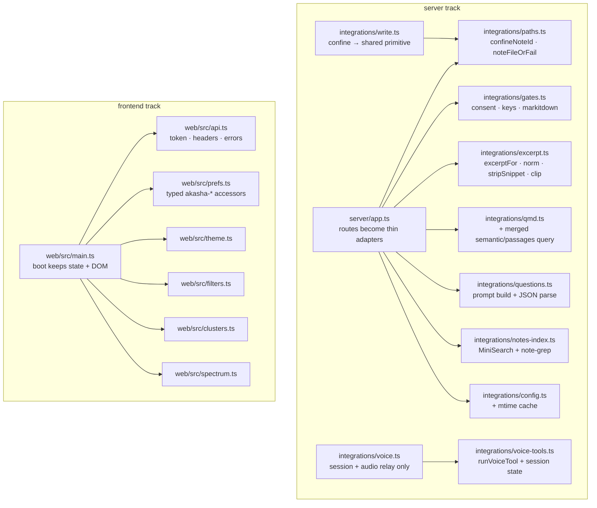
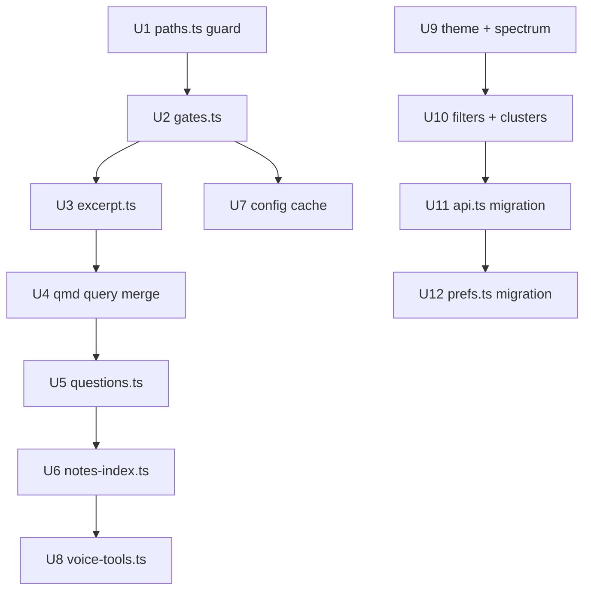

# Architecture Deepening — Enabling Seams - Plan

## Goal Capsule

- **Objective:** Consolidate duplicated cross-cutting logic behind deep modules (path guard, application gates, fetch layer, typed prefs) and extract untestable inline business logic (server route bodies, pure frontend logic, voice tool dispatch) into tested modules — with zero behavior change.
- **Authority hierarchy:** This plan > repo conventions in `CLAUDE.md` > implementer judgment. Where this plan and observed code behavior disagree, preserve observed behavior and flag the discrepancy; behavior preservation outranks plan prose.
- **Stop conditions:** Stop and surface (do not guess) if: a unit requires changing an HTTP response body/status, a `localStorage` key name, or a user-visible behavior beyond what its Approach explicitly authorizes; or if `npm test` reveals a pre-existing failure unrelated to the unit.
- **Execution profile:** One unit per commit, in dependency order. Server track (U1–U8) and frontend track (U9–U12) are independent; within each track, follow the listed order to avoid merge friction in the shared files (`server/app.ts`, `web/src/main.ts`).
- **Tail ownership:** Implementer runs the Verification Contract after every unit and the full Definition of Done at the end.

---

## Product Contract

### Summary

Solaris is a local-first 3D vault visualizer. Its integration modules (`server/integrations/`) are individually deep, injected, and tested — but two files absorbed everything else: `server/app.ts` (2,108 lines) holds inline business logic plus a release-critical path guard copy-pasted at six route sites (a seventh variant lives in `write.ts`), and `web/src/main.ts` (6,512 lines) is a single `boot()` closure with ~70 shared mutable variables, 40 inline `fetch()` calls (the CSRF token header hand-built at 17 of them), and ~20 `akasha-*` `localStorage` keys touched from ~50 inline call sites. The frontend has zero tests. This plan creates the missing seams and moves logic behind them, without dismantling `boot()` itself (that is deferred follow-up work enabled by this plan).

### Problem Frame

Duplicated guards drift (seven copies of the path-confinement invariant are seven future security bugs), inline logic is only testable through full HTTP round-trips, and the frontend's pure logic (filters, clustering, color math) is trapped in a closure so it cannot be tested at all. The fix is depth: one interface per concern, one place to test, one place to fix.

### Requirements

**Server seams**

- R1. All vault-note path validation in read routes flows through one guard module; the six inline guards in `server/app.ts` are replaced by calls to it, and `server/integrations/write.ts` `confine()` reuses the same confinement primitive. Each route's exact current status codes and fallback behaviors are preserved.
- R2. The repeated application gates — web consent + Exa key, OpenRouter key, markitdown presence — are provided by one gates module; every gated route calls it. Each route's current error body and status are preserved verbatim.
- R3. Inline business logic in `server/app.ts` moves behind `server/integrations/` seams with unit tests: excerpt/snippet heuristics (R3a), the near-duplicate qmd query functions merged into one (R3b), note-questions prompt assembly + response parsing (R3c), note-grep and MiniSearch indexing (R3d).
- R4. `loadConfig()` stops re-reading disk on every call: an mtime-checked cache inside `config.ts`, transparent to all 17 call sites (16 in `server/app.ts`, 1 in `server/integrations/voice.ts`).
- R5. The voice tool-dispatch layer (`callTool`/`runTool` + working-document state in `voice.ts`) is testable without a live WebSocket or Gemini client, via an injected fetch.

**Frontend seams**

- R6. All frontend server calls go through one `api()` module owning token memoization, headers, JSON encode/decode, and error signaling. No call site hand-builds the `x-solaris-token` header. Per-site failure semantics are preserved: only sites that already branch on `res.ok` migrate to the throwing `api()`; ok-uncheck sites keep `fetch` semantics via `apiRaw` (see KTD4).
- R7. All `localStorage` persistence goes through one typed `prefs` module. Key names (`akasha-*`) and stored formats are byte-identical to today.
- R8. The pure frontend logic — themes/palette/`nodeColor`, filter matching, semantic clustering, spectrum color math — lives in standalone `web/src/` modules with data-in/data-out interfaces, imported by `boot()`.
- R9. `web/src` gains vitest unit tests for every extracted module, running under the existing `npm test` (vitest's default include already picks up `web/src/*.test.ts`; no config change expected).

**Constraints**

- R10. Behavior-preserving throughout: no UI change, no HTTP contract change, no `localStorage` format change. Divergent error bodies (e.g., the two OpenRouter gate messages) are preserved as-is, not unified.
- R11. `npm test` and `npm run typecheck` pass after every unit. The trust-model tests (path traversal, consent gates, token enforcement) are release-blocking and must never be weakened.

### Scope Boundaries

**Deferred to Follow-Up Work** (enabled by this plan, not part of it)

- Extracting the `boot()` regions themselves: reader pane hub, research column, Three.js graphics/particles/buffers, admin/menubar. These ride on shared closure state; this plan removes the substrates (R6–R8) first. Extraction should follow the `web/src/voice.ts` model: one entry function, a handlers object, a returned handle.
- A DOM-id registry / element-ref module for the 124 ids `main.ts` looks up by string.
- Read-path symlink parity: the read-route guard (U1's `confineNoteId`) deliberately preserves the current behavior of NOT resolving symlinks, while `write.ts` `confine()` does a realpath check. Closing this pre-existing asymmetry (adding a realpath check to `noteFileOrFail`) is a natural follow-up unit once U1 lands — kept out of this plan because it changes read-route behavior for symlinked vaults.
- A unified frontend notification module (replacing `researchError`, `flashAdmin`, ad-hoc `innerHTML` error sinks) and the cleanup of the ~39 empty `catch {}` blocks — both change user-visible error behavior, so they are out of this plan.
- Unifying the OpenRouter gate error bodies (`"Add an OpenRouter key before wiki ingest"` vs `"no-openrouter-key"`) — needs a frontend audit of which strings are matched.
- Splitting `server/app.ts` into express routers per domain.

**Outside this plan's identity**

- Redesigning the integrations layer, the `createApp()` injection seam, or the scanner — they are the well-shaped parts this plan imitates.
- Anything that complicates rebasing on the `upstream` (`chntnm/akasha`) remote beyond what file extraction already does.

### Sources

- Architecture review (2026-07-06): two exploration passes over `web/src/main.ts` and `server/**`; findings verified against source. Note: the review's claim that the guard at `/api/note-questions` had drifted (missing prefix check) was **verified false** — all six route guards carry the full check today. U1 is consolidation against future drift, not a bugfix.
- `docs/solutions/qmd-vsearch-latency.md` — why qmd queries are `vec:`-typed; U4 must preserve this.
- `CLAUDE.md` — trust-model invariants, single-write-path rule, test layout.

---

## Planning Contract

### Key Technical Decisions

- **KTD1 — Guard module shape.** `server/integrations/paths.ts` exports a pure confinement primitive `confineNoteId(vaultRoot, id)` returning the resolved absolute path or `null` when the id is empty, `phantom:`-prefixed, escapes `resolve(vaultRoot) + sep`, or does not end in `.md` (case-insensitive) — plus a `noteFileOrFail(vaultRoot, id)` wrapper that additionally checks `existsSync` and throws `WriteError` (imported from `write.ts`) with the same 400/404 split `notePathOrFail` uses today. Routes that currently *fall back* instead of erroring (`/api/note-questions` returns templates) call the primitive and branch; routes that error keep their exact statuses. Rationale: one seam, two call styles, zero behavior change.
- **KTD2 — `write.ts` keeps its interface.** `confine()` in `write.ts` becomes a thin call to the shared primitive plus its write-specific extras (target may not exist yet; symlink realpath checks stay where they are). The write path's own tests (`write.test.ts`) are the regression net. Never introduce a second writer.
- **KTD3 — Gates as helper functions, not express middleware.** `server/integrations/gates.ts` exports helpers that take `(cfg, res)` and return `false` after writing the route's current error response, e.g. `requireWebConsentAndExaKey`, `requireOpenRouterKey(cfg, res, message)`, `requireMarkitdown`. Handler style stays `if (!gate(...)) return;`, matching the existing `markitdownBinOrFail` pattern at `server/app.ts` (`markitdownBinOrFail`). Middleware would fight the routes that gate conditionally. The message parameter preserves today's divergent bodies (R10).
- **KTD4 — Frontend `api()` module.** `web/src/api.ts` exports `api(path, opts?)`: GET by default; `{ json }` triggers POST/PUT with `content-type` + `x-solaris-token`; token memoized internally (absorbing `apiToken`/`sessionToken` from `main.ts`); non-OK responses throw an `ApiError` carrying status and parsed body. An `apiRaw(path, init?)` escape hatch preserves plain `fetch` semantics (resolves on 4xx/5xx, non-JSON bodies, uploads). **Throw-on-non-OK is behavior-preserving only for call sites that already branch on `res.ok`** — `fetch` resolves on 4xx/5xx, so a site that reaches `.json()` with no ok-check currently *continues* on an error response. Those sites migrate to `apiRaw` (keeping non-throwing semantics), not `api()`; U11 enumerates them before migrating anything.
- **KTD5 — `prefs` over an injected storage.** `web/src/prefs.ts` defines one typed accessor per existing `akasha-*` key, over a `Storage`-like interface defaulting to `window.localStorage`; tests inject a `Map`-backed fake. Two adapters justify the seam. Serialization per key is copied verbatim from the current call sites (some keys store raw strings, some JSON — preserve each exactly).
- **KTD6 — Pure modules take data, return data.** Extracted functions receive what they read from the closure as parameters (e.g., `computeSemanticClusters(nodes, semanticLinks)`) and return results; `boot()` keeps owning the mutable state and DOM writes. No module-level mutable state in the new files.
- **KTD7 — No vitest config change.** A root `vitest.config.ts` already exists with `include: ["**/*.test.ts"]` and `environment: "node"`, so `web/src/*.test.ts` files are already discovered and no extracted module touches the DOM. The first frontend test file (U9) proves discovery; if the include ever needs widening, edit the existing `vitest.config.ts` — never add a second config file.
- **KTD8 — Voice dispatch extraction.** `server/integrations/voice-tools.ts` exports the tool declarations (`VOICE_TOOLS`), a session-state factory (working-document id, contract-read tracking), and `runVoiceTool(name, args, ctx)` where `ctx` carries `{ base, fetchFn, state, ... }`. `voice.ts` keeps the Gemini session + audio relay and delegates every tool call. Tests drive `runVoiceTool` with a fake `fetchFn`. The loopback-HTTP design stays (it reuses the guard/consent stack deliberately).
- **KTD9 — Config cache inside `config.ts`.** `loadConfig()` gains an internal `{ path, mtimeMs, value }` memo: `statSync` the file, return the cached parse when mtime is unchanged. Transparent to all 17 call sites (16 in `app.ts`, 1 in `voice.ts`); `updateConfig()` invalidates. A stat per call replaces a read+parse per call; no interface change.
- **KTD10 — Line numbers are hints, symbols are anchors.** Units cite function/route names as the durable reference. Line numbers in this plan reflect 2026-07-06 HEAD (`e840adc`) and will shift as units land — always locate by symbol.

### High-Level Technical Design

Target topology — new modules (dark) and what they absorb:

Unit dependency order (arrows = must land first; tracks are mutually independent):

The server-track chain is sequencing to avoid `app.ts` merge friction, not logical dependency (only U5 truly needs U2's OpenRouter gate and U3's excerpt style). Frontend likewise: U9–U12 all edit `main.ts`, so land them in order.

---

## Implementation Units

Unit Index:

| U-ID | Title | Key files | Depends on |
|------|-------|-----------|------------|
| U1 | Vault-path guard module | `server/integrations/paths.ts`, `server/app.ts`, `server/integrations/write.ts` | — |
| U2 | Application gates module | `server/integrations/gates.ts`, `server/app.ts` | U1 |
| U3 | Excerpt/snippet module | `server/integrations/excerpt.ts`, `server/app.ts` | U2 |
| U4 | Merge qmd query duplicates | `server/integrations/qmd.ts`, `server/app.ts` | U3 |
| U5 | Note-questions module | `server/integrations/questions.ts`, `server/app.ts` | U4 |
| U6 | Search + grep module | `server/integrations/notes-index.ts`, `server/app.ts` | U5 |
| U7 | Config mtime cache | `server/integrations/config.ts` | U2 |
| U8 | Voice tool-dispatch seam | `server/integrations/voice-tools.ts`, `server/integrations/voice.ts` | U6 |
| U9 | Pure modules: theme + spectrum | `web/src/theme.ts`, `web/src/spectrum.ts`, `web/src/main.ts` | — |
| U10 | Pure modules: filters + clusters | `web/src/filters.ts`, `web/src/clusters.ts`, `web/src/main.ts` | U9 |
| U11 | Frontend `api()` module + migration | `web/src/api.ts`, `web/src/main.ts` | U10 |
| U12 | Typed `prefs` module + migration | `web/src/prefs.ts`, `web/src/main.ts` | U11 |

### U1. Vault-path guard module

- **Goal:** One confinement seam for every vault-note path check; six inline copies in `app.ts` deleted; `write.ts` shares the primitive.
- **Requirements:** R1, R10, R11.
- **Dependencies:** none.
- **Files:** create `server/integrations/paths.ts`, `server/integrations/paths.test.ts`; modify `server/app.ts`, `server/integrations/write.ts`.
- **Approach:** Current state: `server/app.ts` inlines the guard in `/api/related`, `/api/note-questions`, `/api/note`, `/api/note-lines`, `/api/note-grep` (locate by route path; the pattern is `resolve(vaultRoot, id)` + `startsWith(resolve(vaultRoot) + sep)` + `.md` check + `existsSync`), and has a partial seam `notePathOrFail` (used by git/promote helpers) that also rejects `phantom:` ids and throws `WriteError`. `server/integrations/write.ts` has `confine(vaultRoot, rel)` with the same invariant plus write-side extras. Build `paths.ts` per KTD1: `confineNoteId` (pure, returns path or `null`) and `noteFileOrFail` (throws `WriteError(400/404)` exactly like `notePathOrFail` today: empty/`phantom:` → 404 "note not found", escape/extension → 400 "invalid note id", missing file → 404). Migrate: `notePathOrFail` becomes a re-export or one-line wrapper; error-responding routes map thrown `WriteError` through the existing `writeFail` helper or keep their current explicit `res.status(...)` branches by calling `confineNoteId` and branching — whichever preserves each route's exact bodies (compare with tests before/after). `/api/note-questions` keeps its fall-back-to-templates behavior via `confineNoteId` + branch. In `write.ts`, `confine()` calls `confineNoteId` for the shared invariant and keeps its write-specific checks in place.
- **Patterns to follow:** `notePathOrFail` in `server/app.ts` (the error split to preserve); `server/integrations/write.ts` `WriteError`; test style of `server/integrations/write.test.ts` and the traversal tests in `server/app.test.ts`.
- **Test scenarios:** `paths.test.ts` — happy path: a vault-relative `notes/a.md` resolves under the root. Traversal: `../outside.md`, absolute path, `..%2f`-style already-decoded segments, and a path resolving exactly to `vaultRoot` (no trailing separator) all return `null`/throw. Extension: `.MD` accepted (case-insensitive), `.txt` rejected. `phantom:x` rejected. `noteFileOrFail`: missing file → `WriteError` 404; escaping id → 400. Existing suites `server/app.test.ts` (traversal negatives on `/api/note`) and `server/integrations/write.test.ts` pass unchanged — they are the proof of behavior preservation.
- **Verification:** `npm test` and `npm run typecheck` green; `grep -cE 'startsWith\(resolve\(vaultRoot\) \+ sep\)|startsWith\(vaultBase\)' server/app.ts` drops from 6 to 0 (four of the six guards use the hoisted `vaultBase` const, two use the inline form — the grep must match both spellings); every previous guard site now imports from `paths.ts`.

### U2. Application gates module

- **Goal:** The consent/key/tool gates become one seam; per-route copies deleted; bodies byte-identical.
- **Requirements:** R2, R10, R11.
- **Dependencies:** U1 (sequencing in `app.ts`).
- **Files:** create `server/integrations/gates.ts`, `server/integrations/gates.test.ts`; modify `server/app.ts`.
- **Approach:** Current state (locate by route): web consent + Exa key checks are inlined in `/api/ingest` (URL branch), `/api/research`, `/api/article` — each pair is `!cfg.consents.web` → 403 and missing `exaKey` → 400. markitdown-missing 503 (`error: "markitdown-missing"`) appears in `/api/ingest`, `/api/ingest-upload`, and the factored `markitdownBinOrFail`. OpenRouter-key checks appear in the wiki-ingest propose helpers and routes (`WriteError(400, "Add an OpenRouter key before wiki ingest")` / `res.status(400)` with the same message) and `/api/llm/models` (`error: "no-openrouter-key"`). Build `gates.ts` per KTD3, with each helper writing the exact response the route writes today (message passed in where routes differ). Migrate all sites; keep `markitdownBinOrFail` but move its body into `gates.ts` (or have it delegate) so the two older inline copies use the same code path. Do not unify the OpenRouter messages (deferred, see Scope Boundaries).
- **Patterns to follow:** the existing `markitdownBinOrFail` call style (`const bin = await markitdownBinOrFail(res); if (!bin) return;`); consent-gate tests in `server/integrations/exa.test.ts` / `api.test.ts`.
- **Test scenarios:** `gates.test.ts` — for each helper: blocked case writes the documented status+body and returns false/null; allowed case writes nothing and returns the value (true / bin path). Regression: existing consent-gate tests in the server suites pass unchanged. One test asserts `/api/llm/models` still answers `no-openrouter-key` and wiki-ingest still answers the prose message (the divergence is intentional).
- **Verification:** `npm test` + `npm run typecheck` green; no route builds a consent/key/markitdown response inline anymore (grep for `"markitdown-missing"` and `"Add an OpenRouter key"` — only `gates.ts` and tests match).

### U3. Excerpt/snippet module

- **Goal:** The markdown-cleaning heuristics get an interface and unit tests.
- **Requirements:** R3a, R10, R11.
- **Dependencies:** U2 (sequencing).
- **Files:** create `server/integrations/excerpt.ts`, `server/integrations/excerpt.test.ts`; modify `server/app.ts`.
- **Approach:** Move `excerptFor`, `norm`, `stripSnippet`, `clip` (closures inside `createApp`, near the qmd bridge region) into `excerpt.ts` verbatim. `excerptFor` currently closes over `vaultRoot` and reads the file itself — export it as `excerptFor(vaultRoot, id, title)` (or take the raw content: `excerptFromContent(raw, title)` with a thin file-reading wrapper — implementer's choice, but the file read must stay `try/catch → ""` on failure exactly as today). `app.ts` imports and passes `vaultRoot`.
- **Patterns to follow:** module shape of `server/integrations/topology.ts` (pure functions over graph data, no state).
- **Test scenarios:** `excerpt.test.ts` — frontmatter `description:` wins when ≥25 chars and not a title echo; quoted values unquoted; body fallback accumulates paragraphs to ~280 chars skipping short/`title-echo paragraphs; `norm` strips non-alphanumerics and lowercases; `stripSnippet` removes markdown links/emphasis (mirror what the implementation strips — write tests from the moved code, not from this plan's summary); `clip` cuts at the limit without mid-word artifacts per its current logic; unreadable file → `""`.
- **Verification:** `npm test` + `npm run typecheck` green; `/api/related` responses unchanged (existing `qmd.test.ts` fixtures pass).

### U4. Merge qmd query duplicates

- **Goal:** The two near-duplicate ~30-line query functions collapse into one, living behind the qmd seam.
- **Requirements:** R3b, R10, R11.
- **Dependencies:** U3.
- **Files:** modify `server/integrations/qmd.ts`, `server/integrations/qmd.test.ts`, `server/app.ts`.
- **Approach:** `semanticQuery` and `passagesQuery` (closures in `app.ts`, qmd bridge region) differ only in flags/shape of the qmd invocation and result mapping. Diff them line-by-line first; extract one parameterized function into `qmd.ts` next to the existing `vsearch()` and re-express both call sites through it. Preserve the `vec:` query typing (see `docs/solutions/qmd-vsearch-latency.md` — untyped queries trigger a 30s+ LLM expansion) and the defensive JSON parsing (progress noise around the array). `collections()` and `qmdSearch()` closures may move too if they fall out naturally — but only if the diff stays mechanical; otherwise leave them.
- **Patterns to follow:** existing `vsearch()` in `server/integrations/qmd.ts` (injectable runner, `vec:` typing).
- **Test scenarios:** extend `qmd.test.ts` — the merged function issues a `vec:`-typed query (assert on the fake runner's argv); both former shapes (semantic-search results, passages results) map fixture output identically to before (capture current outputs as fixtures before refactoring); malformed JSON with progress noise still parses from the first `[`.
- **Verification:** `npm test` + `npm run typecheck` green; `/api/semantic-search` and `/api/passages` behavior unchanged against the fake runner fixtures.

### U5. Note-questions module

- **Goal:** LLM prompt assembly and response parsing for note questions become a tested module; the route becomes a thin adapter.
- **Requirements:** R3c, R10, R11.
- **Dependencies:** U4.
- **Files:** create `server/integrations/questions.ts`, `server/integrations/questions.test.ts`; modify `server/app.ts`.
- **Approach:** The `/api/note-questions` handler inlines: guard + fallback to `noteQuestions()` templates (from `topology.ts`), a frontmatter-stripped 1500-char excerpt, phantom-neighbor collection from graph links, prompt assembly, an OpenRouter call, and hand-rolled JSON-array extraction (`indexOf("[")`/`lastIndexOf("]")` slice + parse, falling back to templates on failure). Move everything between guard and response into `questions.ts`: `buildNoteQuestionsPrompt(note, excerpt, phantomTitles)` and `parseQuestionsReply(text)` (returns `string[]` or `null` → caller falls back to templates), plus an orchestrating `noteQuestionsViaLLM(deps)` that takes the `chatCompletion` function as a parameter (same DI style `wiki-ingest.ts` uses). Route keeps: guard branch, templates fallback, response shape `{ questions, source }`.
- **Patterns to follow:** `server/integrations/wiki-ingest.ts` (LLM DI + JSON proposal parsing); `topology.ts` `noteQuestions` (the template fallback it must keep honoring).
- **Test scenarios:** `questions.test.ts` — prompt includes note title, excerpt, and phantom titles when present, omits the phantom line when none; parse: clean JSON array passes through; array wrapped in prose/code fences extracted via first-`[`/last-`]`; non-array or unparseable → `null`; orchestrator returns templates-shaped fallback signal when the LLM call throws. Regression: no-key path still returns `source: "templates"` (existing behavior, gate from U2).
- **Verification:** `npm test` + `npm run typecheck` green; `/api/note-questions` responses unchanged for: no key, invalid id, LLM success, LLM garbage reply.

### U6. Search + grep module

- **Goal:** MiniSearch indexing/snippets and the note-grep scan become a tested module.
- **Requirements:** R3d, R10, R11.
- **Dependencies:** U5.
- **Files:** create `server/integrations/notes-index.ts`, `server/integrations/notes-index.test.ts`; modify `server/app.ts`.
- **Approach:** Move the `buildIndex`/`snippet` MiniSearch machinery (search region of `app.ts`, used by `/api/search`) and the literal-scan-with-context-windows logic inside `/api/note-grep` into `notes-index.ts`. Interfaces: `buildSearchIndex(nodes, vaultRoot)` → handle with a `search(query)` returning today's result shape; `grepNote(content, query, contextLines)` → today's match shape. The route keeps the guard (from U1) and request parsing. Index rebuild timing (on reload/rescan) must stay identical — check where `buildIndex` is invalidated today and preserve it.
- **Patterns to follow:** `server/integrations/semantic.ts` (build-once, cache-by-fingerprint discipline); existing `/api/search` tests if present in `server/app.test.ts`.
- **Test scenarios:** `notes-index.test.ts` — search: title match ranks a note; snippet contains the matched term with ellipsis behavior copied from current output; empty query behavior identical to today (capture first). grep: literal match returns correct line numbers and context window; multiple matches; no match → empty; query with regex metacharacters treated literally.
- **Verification:** `npm test` + `npm run typecheck` green; `/api/search` and `/api/note-grep` outputs byte-identical on a fixture vault (capture before/after in the test).

### U7. Config mtime cache

- **Goal:** `loadConfig()` stops re-reading and re-parsing disk on every call.
- **Requirements:** R4, R10, R11.
- **Dependencies:** U2 (sequencing only; independent logically).
- **Files:** modify `server/integrations/config.ts`, `server/integrations/config.test.ts`.
- **Approach:** Per KTD9: module-level memo keyed by path holding `{ mtimeMs, value }`; `loadConfig` stats the file, returns the memo when mtime matches, re-reads otherwise; missing file keeps returning the default config (current behavior); `updateConfig` writes and refreshes/invalidates the memo. All 17 call sites (16 in `app.ts`, 1 in `voice.ts`) are untouched.
- **Patterns to follow:** the `colCache`/`toolCache` handles in `app.ts` (existing cache idioms).
- **Test scenarios:** extend `config.test.ts` — two `loadConfig` calls without file change hit the cache (spy on fs read or assert via injected mtime); external file edit (bump mtime) is picked up; `updateConfig` then `loadConfig` returns the new value; missing file still yields defaults; secrets still never appear in the sanitized output paths.
- **Verification:** `npm test` + `npm run typecheck` green; behavior of `/api/config` GET/POST unchanged.

### U8. Voice tool-dispatch seam

- **Goal:** The untested voice business rules become testable without a live socket or Gemini client.
- **Requirements:** R5, R10, R11.
- **Dependencies:** U6 (sequencing).
- **Files:** create `server/integrations/voice-tools.ts`, `server/integrations/voice-tools.test.ts`; modify `server/integrations/voice.ts`.
- **Approach:** Per KTD8. Move from `voice.ts`: the `VOICE_TOOLS` declarations, `callTool` (read-only tools) and `runTool` (stateful tools), and the mutable session state (`workingDocId`, `contractWikisRead`) into `voice-tools.ts`. Shape: `createVoiceToolSession(ctx)` returning `{ run(name, args) }`, where `ctx` carries `base` (loopback URL), `fetchFn` (defaults to global fetch), the session token getter, and config access — everything `runTool`/`callTool` currently close over. `voice.ts` keeps `BASE_SYSTEM_PROMPT`, `buildVoiceSystemPrompt`, the Gemini connection, and the audio relay; its tool-call loop delegates to the session object. The loopback-HTTP design is deliberate (reuses guard/consent stack) — do not replace HTTP calls with direct function calls.
- **Patterns to follow:** existing exported-for-test seam `buildVoiceSystemPrompt` (`voice.test.ts`); DI style of `detectDeps.run` in `detect.ts`.
- **Test scenarios:** `voice-tools.test.ts` with a fake `fetchFn` — the `save_working_document` guard: rejected with the current error message when no `read_wiki_contract` happened this session; allowed after; `write_document` mints ids in the current format and tracks `workingDocId`; a read-only tool (e.g. `find_notes`) issues the expected loopback path+params and maps the response; an HTTP error from `fetchFn` surfaces as the tool-error shape the Gemini loop expects (capture current shape first); promote flows hit `/api/document/:id/promote` with the working doc id.
- **Verification:** `npm test` + `npm run typecheck` green (including existing `voice.test.ts`, `voice-promote.test.ts`); manual smoke: start `npm run dev`, open voice, confirm a tool round-trip (list wikis) still works.

### U9. Pure frontend modules: theme + spectrum

- **Goal:** Color/theme resolution and spectrum color math become importable, tested modules — and the first frontend tests prove the vitest setup.
- **Requirements:** R8, R9, R10, R11.
- **Dependencies:** none (frontend track start).
- **Files:** create `web/src/theme.ts`, `web/src/spectrum.ts`, `web/src/theme.test.ts`, `web/src/spectrum.test.ts`; modify `web/src/main.ts`.
- **Approach:** `THEMES`, `PALETTE`, `FALLBACK_COLORS` are already top-level `const`s in `main.ts` (lines ~82–274) — move them plus the `ThemeDef` type into `theme.ts` and export. `nodeColor(n)` is inside `boot()` and reads closure state (`groupMode`, `customColors`, etc.) — extract the pure resolution as `nodeColorFor(n, deps)` where `deps` carries exactly what it reads (inspect the function body and pass each closure variable as a field); the closure keeps a one-line `nodeColor` wrapper binding current state. `spectrumComplement` and `spectrumHslToRgb` are pure — move verbatim into `spectrum.ts`. Per KTD7 the existing root `vitest.config.ts` (`include: ["**/*.test.ts"]`, `environment: "node"`) already discovers the new test files — no config change; if the include ever needs widening, edit that existing file, never add a second config.
- **Patterns to follow:** `web/src/i18n.ts` and `web/src/voice.ts` — the two existing extracted frontend modules (import style, no module-level mutable state).
- **Test scenarios:** `theme.test.ts` — every theme in `THEMES` has the full CSS-variable key set (guards the add-a-theme convention in `CLAUDE.md`); `nodeColorFor` resolves: explicit custom color wins, then group palette, then fallback cycle (derive exact precedence from the moved code); unknown group falls to `FALLBACK_COLORS` deterministically. `spectrum.test.ts` — `spectrumHslToRgb` on known anchors (h=0/120/240 at full s/l midpoint) matches expected RGB; `spectrumComplement` of a known hex returns its complement and round-trips.
- **Verification:** `npm test` runs the new files (visible in vitest output) and passes; `npm run typecheck` green; `npm run dev` manual smoke — themes switch identically, node colors unchanged for a known vault.

### U10. Pure frontend modules: filters + clusters

- **Goal:** Filter matching and semantic clustering become pure, tested modules.
- **Requirements:** R8, R9, R10, R11.
- **Dependencies:** U9.
- **Files:** create `web/src/filters.ts`, `web/src/clusters.ts`, `web/src/filters.test.ts`, `web/src/clusters.test.ts`; modify `web/src/main.ts`.
- **Approach:** Move `subsequence`, `filterFields`, `compileMatcher` (in `boot()`, filter region ~1311–1350) into `filters.ts`; `filterFields(n)` is pure over `GNode`; `compileMatcher(pattern)` returns a predicate — both move verbatim (bring the `GNode` type import along; if `GNode` is declared inside `main.ts`, move the type to a shared `web/src/types.ts` and import it from both — smallest possible type move, nothing else). `activeChain()` reads the closure's `filters`/`liveFilter` state — keep it in `boot()` as a thin composition over the moved pieces. Move `computeSemanticClusters` (~1060–1140, deterministic label propagation) as `computeSemanticClusters(nodes, semanticLinks)` returning the id→cluster map instead of writing closure state; `boot()` assigns the result.
- **Patterns to follow:** U9's extraction style; determinism note in `CLAUDE.md` (label propagation is deliberately deterministic — seed/order must not change).
- **Test scenarios:** `filters.test.ts` — `subsequence`: subsequence hit, miss, empty needle; `compileMatcher`: plain substring match across fields (title/tags/type per `filterFields`), a pattern with regex metacharacters behaves as today (literal or regex — derive from the moved code), case sensitivity matches today. `clusters.test.ts` — two disconnected cliques get two clusters; deterministic across runs (same input → same labels, run twice); singleton nodes; empty edge set → every node its own cluster or per current behavior (capture first).
- **Verification:** `npm test` + `npm run typecheck` green; manual smoke — type a filter in the UI, results identical; `group by: semantic cluster` colors unchanged for the same `data/semantic.json`.

### U11. Frontend `api()` module + migration

- **Goal:** One deep fetch interface; the 40 inline `fetch()` calls and 17 hand-built token headers are gone.
- **Requirements:** R6, R9, R10, R11.
- **Dependencies:** U10 (sequencing in `main.ts`).
- **Files:** create `web/src/api.ts`, `web/src/api.test.ts`; modify `web/src/main.ts`.
- **Approach:** Per KTD4. Absorb `apiToken`/`sessionToken`/`postConfig` from `main.ts` (~3185–3195). **Step 0 — classify before migrating:** list every `fetch(` call (`grep -n "fetch(" web/src/main.ts`; expect ~40) and mark each site: (a) checks `res.ok` (or is wrapped in a `try/catch` that handles failure) → migrate to `api()`, keeping the same branch via `try/catch ApiError`; (b) reaches `.json()`/`.text()` with NO ok-check and no catch → migrate to `apiRaw` so it keeps `fetch`'s non-throwing-on-4xx semantics (today these sites *continue* on an error response; `api()` throwing there would change behavior, violating R10); (c) non-JSON (upload `FormData`, text, blobs) → `apiRaw`. Sites that ignored failures keep ignoring them — do NOT add new error surfacing in this unit. `voice.ts`'s own WebSocket/token usage is out of scope. Work in passes (category a, then b, then c), running the app between passes.
- **Patterns to follow:** the current `postConfig` (the seed of this module); token header shape `{"content-type":"application/json","x-solaris-token": ...}` must be byte-identical (server's `security.ts` validates it).
- **Test scenarios:** `api.test.ts` with a stubbed global fetch — GET returns parsed JSON; first mutating call fetches `/api/session` once and memoizes (second call: no extra session fetch); mutating call carries `content-type` and `x-solaris-token` headers and stringified body; non-OK response throws `ApiError` with status and parsed body; `apiRaw` passes through untouched.
- **Verification:** `npm test` + `npm run typecheck` green; `grep -c "x-solaris-token" web/src/main.ts` → 0 (only `api.ts` builds it); `grep -cE "\bfetch\(" web/src/main.ts` → 0; manual smoke across the spending/mutating flows — save a note, rescan, semantic search, one wiki-ingest proposal round-trip, orphan link confirm.

### U12. Typed `prefs` module + migration

- **Goal:** All persistence behind one typed interface; key names and formats untouched.
- **Requirements:** R7, R9, R10, R11.
- **Dependencies:** U11.
- **Files:** create `web/src/prefs.ts`, `web/src/prefs.test.ts`; modify `web/src/main.ts`.
- **Approach:** Per KTD5. Inventory first: `grep -n "localStorage" web/src/main.ts` (~20 distinct `akasha-*` keys across ~50 call sites, some keys touched from 2–3 distant sites with per-site parse logic). For each key define one typed accessor pair in `prefs.ts` copying that key's exact serialization (raw string vs `JSON.stringify` — check each site; where two sites disagree on parsing the same key, preserve the reader that runs first at boot and flag the discrepancy in the commit message). Constructor takes a `Storage`-like `{getItem,setItem,removeItem}` defaulting to `window.localStorage`. Migrate all `main.ts` sites. The reader-geometry key (`akasha-reader`) is geometry-critical — verify dock/undock/persist manually after migration.
- **Patterns to follow:** key list and semantics in `CLAUDE.md` (`localStorage` keys are `akasha-*`, kept from upstream — never rename).
- **Test scenarios:** `prefs.test.ts` with a `Map`-backed storage — round-trip each accessor; JSON keys survive parse/stringify identity; missing key returns the same default the boot code used; corrupted JSON in storage falls back exactly as the current inline `try/catch`es do (capture per-key behavior first); no accessor ever writes a key not prefixed `akasha-`.
- **Verification:** `npm test` + `npm run typecheck` green; `grep -c "localStorage" web/src/main.ts` → 0; manual smoke — set theme, arrangement, custom colors, reader geometry; reload the app; all restored identically (compare devtools Application → Local Storage values before/after migration for byte-identity).

---

## Verification Contract

| Gate | Command | Applies to | Pass signal |
|------|---------|-----------|-------------|
| Unit + integration tests | `npm test` | every unit | all green, including new module tests |
| Types | `npm run typecheck` | every unit | zero errors |
| Trust-model negatives | `npm test` (path traversal in `server/app.test.ts` + `paths.test.ts`, consent gates, token enforcement) | U1, U2, U11 especially | release-blocking; never weakened or skipped |
| Frontend smoke | `npm run dev` → manual per unit's Verification bullet | U9–U12, U8 | listed behaviors identical to pre-unit |
| Behavior fixtures | capture route output before refactor, assert identical after | U4, U5, U6 | byte-identical fixture comparison |

The frontend has no test framework for DOM behavior — the new vitest tests cover extracted logic only; every `main.ts` migration unit (U9–U12) requires its manual smoke pass before commit.

---

## Definition of Done

- All twelve units landed as twelve commits (one unit per commit), in dependency order, each passing the Verification Contract at commit time.
- `server/app.ts` contains no inline path guard, consent/key/tool gate, excerpt heuristic, duplicate qmd query, note-questions prompt/parse, or MiniSearch/grep body — routes delegate to `server/integrations/`.
- `web/src/main.ts` contains no `fetch(` call, no `x-solaris-token` literal, no `localStorage` reference, and no longer defines the moved pure functions.
- New modules each have a test file; `npm test` runs frontend tests (visible in output).
- No behavior change observed: trust-model tests green, fixture comparisons identical, manual smoke checklist (themes, filters, clustering, reader geometry, save-note, rescan, semantic search, voice tool round-trip) unchanged.
- No abandoned experiments in the diff: dead helpers, commented-out originals, and unused imports orphaned by the moves are removed.
- `CLAUDE.md` architecture section updated with one line per new module (follow its existing `server/integrations/` bullet style).
